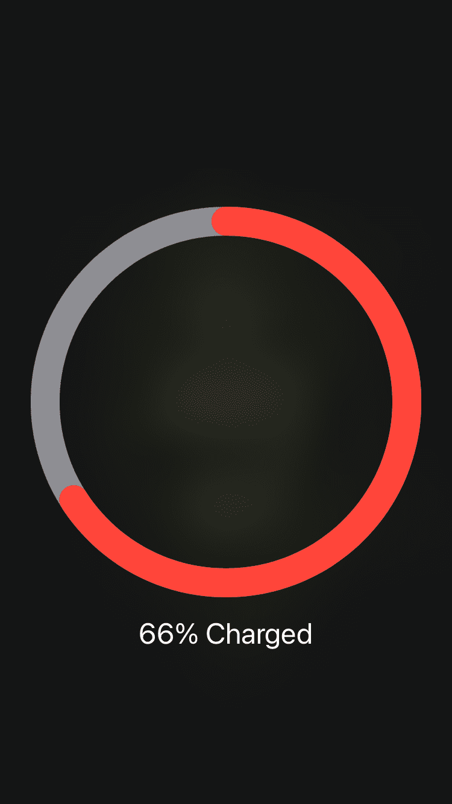

# MagSafe Controller

## Compatibility
iOS 12 and above

## Features:
* recreation of "MagSafe" charging view when connecting device to power source
* native "MagSafe" charging view when connecting device to power source on iOS 14.1 and above
* control size and color of "MagSafe" charging view elements
* ability to control Magsafe view depending on charger type for iOS14 and above

**Make sure that you don't have tweaks that disable charging view**

**Configure options from Settings.**

## Screenshots:
[animation preview](https://gfycat.com/athleticformalboilweevil.gif)

