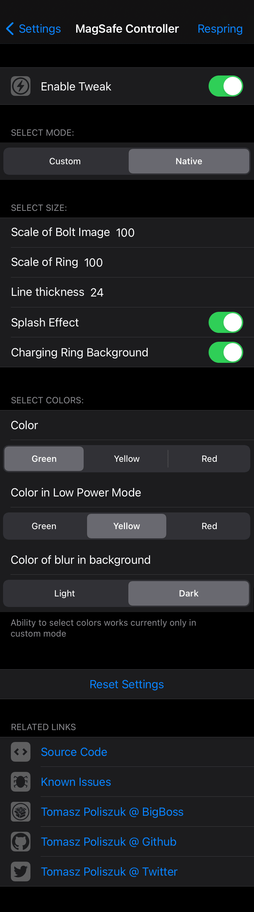
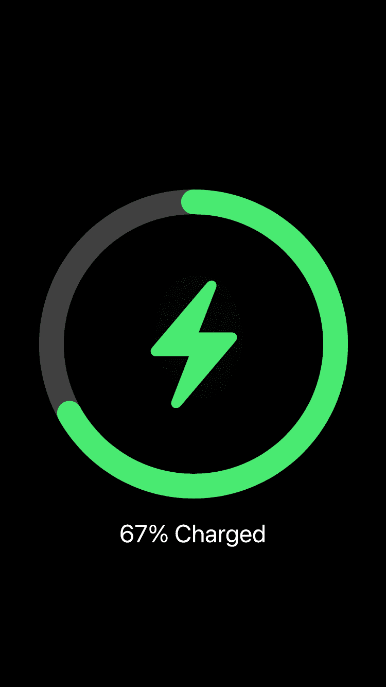
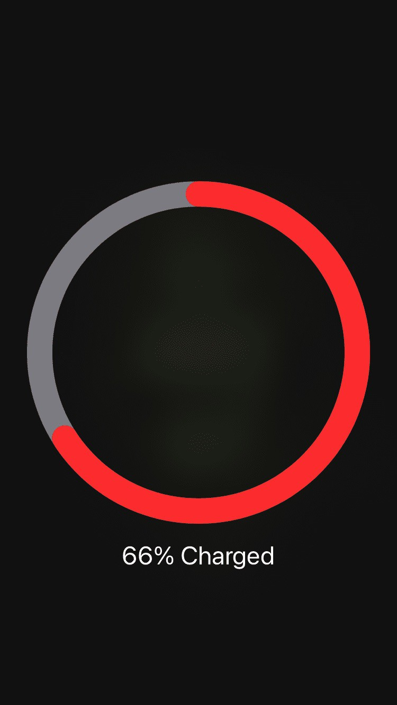

# MagSafe Controller

## Compatibility
iOS 12 and above

## What this tweak do:
* Adds custom recreation of "MagSafe" Charging View charging view when connecting device to power source
* Enables new native "MagSafe" charging view when connecting device to power source on iOS 14.1 and above (on iOS 14.1 you can choose native or custom animation)
* allows to customize size and color of selected elements (some options are currently disabled in native mode)

**Make sure that you don't have tweaks that disable charging view**

**Configure options from Settings.**

## Screenshots:
[animation preview](https://gfycat.com/athleticformalboilweevil.gif)

