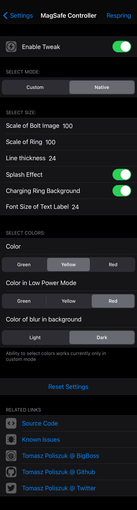

# MagSafe Controller

## Compatibility
iOS 13 and above

## What this tweak do:
- Enables new native "MagSafe" charging view when connecting device to power source on iOS 14.1 and above
- Adds custom recreation of that view on iOS 13 and above (you can also use this one on iOS 14.1)
- allows customize size and color of selected elements (some options are currently disabled in native mode)

**Configure options from Settings.**

## Screenshots:

